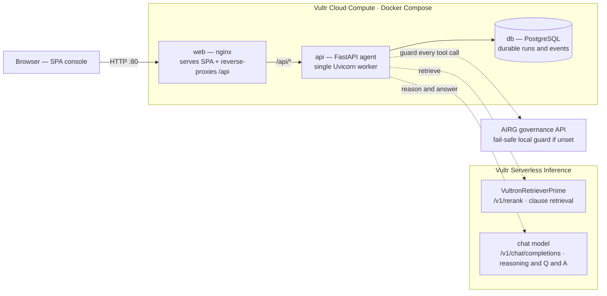
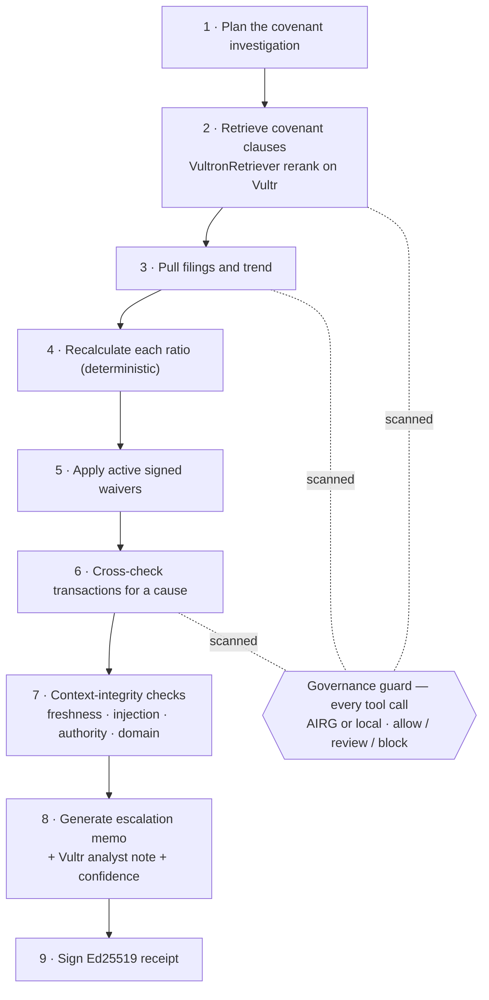
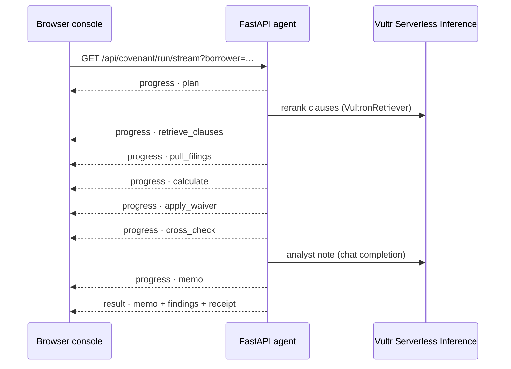
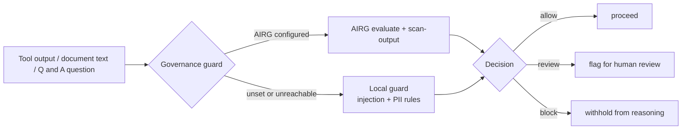
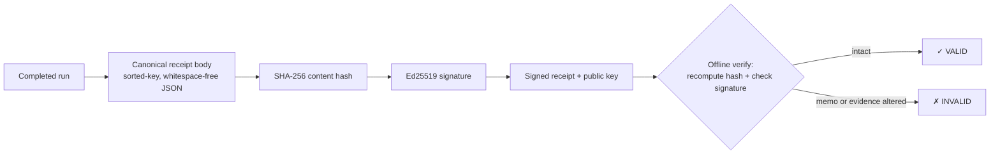

# CovenantOps Agent

**A verifiable, document-grounded enterprise AI agent for loan-covenant monitoring.**

CovenantOps Agent monitors a **portfolio of borrowers**. For each one it ingests the
real document set a credit team works from — a signed credit agreement, waiver
letters, management accounts, transaction exports, even scanned notes — runs a
genuine multi-step investigation to decide whether the borrower is drifting toward
breaching its financial covenants, explains *why* with a citation trail, and produces
an escalation memo backed by a cryptographically **signed receipt anyone can verify
offline**.

It is not a single retrieve-then-answer call. The agent **plans, retrieves more than
once, calls deterministic tools, makes decisions, and produces an outcome a real
credit team could use** — with every tool call **governed** and every conclusion
**verifiable**.

Built for the RAISE Hackathon 2026 (Vultr Track, Statement Two).

---

## Live deployment (Vultr Cloud Compute)

The full stack runs on a Vultr Cloud Compute instance via Docker Compose, with
document retrieval and LLM reasoning on **Vultr Serverless Inference**:

| Surface | URL |
| --- | --- |
| **Console (frontend)** | **http://66.135.27.117** |
| API | http://66.135.27.117/api |
| API docs | http://66.135.27.117/docs |

nginx serves the SPA and reverse-proxies `/api` to the backend, so everything is one
origin on port 80; the API and database are not exposed publicly. See
[`docs/DEPLOY_VULTR.md`](docs/DEPLOY_VULTR.md).

---

## Table of contents

- [What it does](#what-it-does)
- [Capabilities](#capabilities)
- [System architecture](#system-architecture)
- [Agent workflow](#agent-workflow)
- [Real-time progress (streaming)](#real-time-progress-streaming)
- [Governance boundary](#governance-boundary)
- [Verifiable receipts](#verifiable-receipts)
- [Vultr Serverless Inference](#vultr-serverless-inference)
- [Quick start](#quick-start)
- [Configuration](#configuration)
- [API reference](#api-reference)
- [Testing](#testing)
- [Project layout](#project-layout)
- [Security notes](#security-notes)
- [Documentation](#documentation)
- [License](#license)

---

## What it does

A credit team opens the **portfolio**, picks a borrower, and runs an investigation.
The agent grounds its decision in that borrower's documents, streams its progress
step-by-step, and returns an auditable escalation memo:

1. **Portfolio** — every monitored borrower with a live severity (breach / watch /
   within limits) and a cause-attribution confidence.
2. **Investigation** — open a borrower, review/upload its evidence, and run the
   covenant check; the workflow streams live inside the run space.
3. **Decision** — covenant gauges (ratio vs. limit, headroom), an escalation memo
   with citations, and a signed receipt.
4. **Diagnostics** — an audit trail (naming the real AI backends used), an evidence
   graph, context-health checks, and self-evaluation scores.
5. **Ask the agent** — a governed, Vultr-backed Q&A grounded strictly in the run.

The **confidence score reflects how many flagged transactions were matched to a
clear cause versus left unexplained** — an honest signal, not a model's self-report.

## Capabilities

- **Portfolio of borrowers** — five representative borrowers, each with its own
  agreement terms, filings, and transactions; the *same* agent workflow produces a
  distinct, real investigation per borrower.
- **Real document retrieval (RAG)** — covenant clauses are semantically reranked
  against the investigation query by a **VultronRetriever** model on Vultr Serverless
  Inference (`/v1/rerank`), with a deterministic local keyword fallback.
- **Vultr reasoning** — the credit-risk analyst note and the clarifying Q&A run on a
  Vultr chat model (`/v1/chat/completions`).
- **Governed at every step** — every tool call is evaluated at the tool↔agent
  boundary (AIRG when configured, a deterministic local guard otherwise). Prompt
  injection in low-trust documents — and in Q&A questions — is caught before it
  reaches the agent's reasoning.
- **Bring-your-own documents** — upload a credit agreement, waiver, accounts,
  transactions, or a scanned note; each is ingested, trust-tagged, and
  injection-scanned, then grounds the next run.
- **Verifiable output** — every memo is backed by an Ed25519-signed receipt,
  verifiable offline with no server and no trusted third party. Tampering is
  detectable.
- **Real-time workflow** — the agent streams its progress (Server-Sent Events) so the
  console shows the step it is actually executing.
- **Context integrity** — freshness, source-authority conflict, and finance-domain
  checks run before a decision is finalized.
- **Self-improving, safely** — the agent learns to attribute causes across runs; a
  poisoning gate stops a blocked or low-confidence run from teaching.
- **Resilient & durable** — an interrupted run resumes from a checkpoint; runs and
  trace events persist (SQLite locally, PostgreSQL in production).
- **Vultr-native, no GPU** — retrieval and reasoning route to Vultr Serverless
  Inference, with a deterministic local fallback so the demo never breaks.

## System architecture

Single public origin (port 80). The API and database live only inside the compose
network; external AI services are optional and fail safe.



Dotted edges are optional, fail-safe integrations: if a service is unset or
unreachable, the agent continues on a deterministic local path and records which path
it used (`retrieval_path`, `inference_path`, `guard_path`).

## Agent workflow

A genuine multi-step workflow — plan, retrieve more than once, call tools, decide,
produce an outcome — not one RAG call. Every tool call passes the governance guard.



## Real-time progress (streaming)

The console runs the agent over `GET /api/covenant/run/stream` and renders each phase
as its real progress event arrives — no fake timer. Steps light up on the step the
agent is actually executing.



## Governance boundary

Retrieved document text, transaction text, and the user's Q&A question are all
untrusted free text. Each is evaluated before the agent trusts it; the guard fails
safe to a deterministic local layer if AIRG is unreachable.



## Verifiable receipts

Every completed run signs a receipt over the canonical evidence body. Anyone can
verify it offline with only the standalone verifier and the embedded public key.



```bash
python3 backend/tools/verify_receipt.py sample-receipts/valid-receipt.json
#   content hash MATCH, Ed25519 signature VALID  -> exit 0
python3 backend/tools/verify_receipt.py sample-receipts/tampered-receipt.json
#   content hash MISMATCH, signature INVALID     -> exit 1
```

## Vultr Serverless Inference

The Vultr track requires LLM workloads to run on Vultr Serverless Inference (no GPUs
at the event). CovenantOps Agent uses it for both halves of RAG:

| Workload | Endpoint | Model (default) |
| --- | --- | --- |
| **Retrieval** (rank covenant clauses) | `POST /v1/rerank` | `vultr/VultronRetrieverPrime-Qwen3.5-8B` |
| **Reasoning** (analyst note, Q&A) | `POST /v1/chat/completions` | `deepseek-ai/DeepSeek-V4-Flash` |

- Base URL `https://api.vultrinference.com/v1`, auth `Authorization: Bearer <key>`.
- Use a **non-reasoning** chat model so completions return `content` directly (a
  reasoning model can return an empty `content` under a small token budget).
- If Vultr is not configured or unreachable, retrieval falls back to a local keyword
  scorer and reasoning to deterministic local logic. Each run records `retrieval_path`
  and `inference_path` (`vultr` | `local`), surfaced in the Diagnostics **Grounding**
  card and `GET /api/integrations/vultr/status`.

## Quick start

### With Docker (recommended)

```bash
cp .env.example .env
docker compose up --build
```

| Service | URL |
| --- | --- |
| Console | http://localhost |
| API | http://localhost/api |
| API docs | http://localhost/docs |

The `web` container is **nginx**: it serves the built SPA and reverse-proxies `/api`
to the `api` service (same origin, no CORS, no backend host baked into the build). The
API (8000) and database (5432) are internal to the compose network. Runs persist to
the `db` (PostgreSQL) service.

To deploy on **Vultr Cloud Compute**, see [`docs/DEPLOY_VULTR.md`](docs/DEPLOY_VULTR.md).

### Local development

```bash
# backend
cd backend
python3 -m venv .venv && . .venv/bin/activate
pip install -r requirements.txt          # OCR needs the tesseract binary (optional)
uvicorn app.main:app --reload --port 8000

# frontend (second terminal)
cd frontend
npm install
npm run dev          # http://localhost:3000, proxies /api to :8000
```

## Configuration

All configuration is via environment variables (see `.env.example`). Everything
external is optional — the app runs fully, on deterministic local paths, with none set.

| Variable | Default | Purpose |
| --- | --- | --- |
| `COVENANTOPS_AGREEMENT_PDF` | `data/credit_agreement.pdf` | Lead borrower's credit agreement. |
| `COVENANTOPS_EVIDENCE_DIR` | `data/evidence` | Multi-format evidence pack. |
| `COVENANTOPS_UPLOAD_DIR` | `data/evidence` | Destination for uploaded documents. |
| `COVENANTOPS_SIGNING_KEY_B64` | *(generated)* | Base64 Ed25519 signing key. **Set in production** so receipts verify across restarts. |
| `DATABASE_URL` | `sqlite:///./data/covenantops.db` | TraceMemory persistence; PostgreSQL in production. |
| `VULTR_INFERENCE_API_KEY` | *(unset)* | Vultr **Serverless Inference** key (not the account API key). If unset, local fallback. |
| `VULTR_CHAT_MODEL` | `deepseek-ai/DeepSeek-V4-Flash` | Vultr chat model (reasoning + Q&A). |
| `VULTR_RERANK_MODEL` | `vultr/VultronRetrieverPrime-Qwen3.5-8B` | Vultr rerank model (clause retrieval). |
| `VULTR_TIMEOUT_SECONDS` | `20` | Vultr request timeout. |
| `AIRG_URL` | *(unset)* | AIRG governance endpoint. If unset, the local guard is used. |
| `AIRG_API_KEY` | *(unset)* | AIRG API key (`X-API-Key`). |
| `AIRG_TIMEOUT_SECONDS` | `4` | AIRG timeout; a slow API degrades to the local guard. |
| `FRONTEND_ORIGIN` | `http://localhost:3000,http://localhost:5173` | Allowed CORS origins (not needed behind the nginx proxy). |

## API reference

Behind the nginx proxy the base is `/api` (same origin); directly, the API listens on
`:8000`. Interactive docs at `/docs`.

| Method | Endpoint | Purpose |
| --- | --- | --- |
| `GET` | `/api/portfolio` | Monitored borrowers with fast severity + confidence. |
| `POST` | `/api/covenant/run` | Run the agent. Query: `borrower`, `learning`, `attack`, `fail_after`. |
| `GET` | `/api/covenant/run/stream` | Run the agent and **stream** real per-step progress (SSE). Query: `borrower`. |
| `POST` | `/api/covenant/qa` | Governed, Vultr-backed Q&A grounded in a run (`trace_id`, `question`). |
| `POST` | `/api/covenant/resume/{task_id}` | Resume an interrupted run from its checkpoint. |
| `POST` | `/api/evidence/upload` | Upload + ingest a document (multipart). |
| `GET` | `/api/evidence` | List the ingested evidence pack (format, trust level, injection findings). |
| `GET` | `/api/traces/{trace_id}/receipt` | Signed evidence receipt for a run. |
| `GET` | `/api/traces/{trace_id}/receipt/verify` | Server-side verification of a run's receipt. |
| `POST` | `/api/receipts/verify` | Verify a posted receipt payload (tamper demo). |
| `GET` | `/api/traces/{trace_id}/evaluation` | Self-evaluation scores, evidence map, context health. |
| `GET` | `/api/traces/{trace_id}/replay` | Replay a run's tool calls, guard decisions, and outcome. |
| `GET` | `/api/runs` | List persisted runs. |
| `GET` | `/api/receipts/public-key` | Ed25519 public key for offline verification. |
| `GET` | `/api/integrations/vultr/status` | Whether Vultr Serverless Inference is configured + last path used. |
| `GET` | `/api/health` | Liveness, guard path, and integration status. |

## Testing

```bash
cd backend
python3 -m pytest tests -q      # 26 tests
```

The suite covers document ingestion and threshold extraction, the agent workflow and
memo, receipt sign/verify and tamper rejection, governance fail-safe, poisoning-gated
self-improvement and its ablation, recovery/resume, multi-format ingestion with trust
tagging, waiver application, evaluation/evidence-map generation, context-health checks,
and persistent TraceMemory.

## Project layout

```
covenantops-agent/
├── backend/
│   ├── app/
│   │   ├── agent/        # runner (workflow + progress streaming), memo, learning, evaluation
│   │   ├── tools/        # ingestion, extractors/, finance calculations, borrowers (portfolio)
│   │   ├── trust/        # receipt (Ed25519), governance (AIRG + local), context_health,
│   │   │                 #   recovery, trace_memory, vultr_inference (rerank + chat)
│   │   ├── api.py        # FastAPI routes (portfolio, run, run/stream, qa, evidence, receipts)
│   │   ├── main.py       # app entrypoint
│   │   └── models.py     # schemas
│   ├── data/             # lead credit agreement + evidence pack
│   ├── tests/            # pytest suite (26)
│   ├── tools/            # standalone offline receipt verifier
│   ├── Dockerfile
│   └── requirements.txt
├── frontend/             # Vanilla-JS SPA (Vite build) served by nginx
│   ├── index.html        # styles + shell
│   ├── src/main.js       # UI + live fetch/SSE wiring
│   ├── nginx.conf        # SPA + /api reverse proxy
│   └── Dockerfile
├── docs/                 # BRD, TRD, executive summary, evaluation, demo script, DEPLOY_VULTR
├── sample-receipts/      # valid + tampered receipts for the verify demo
├── docker-compose.yml
└── .env.example
```

## Security notes

- **Signing key.** Set `COVENANTOPS_SIGNING_KEY_B64` in production; without it a key
  is generated per instance, so receipts won't verify across restarts/replicas.

  ```bash
  cd backend
  python3 -c "from app.trust.receipt import ReceiptService; print(ReceiptService.generate_key_b64())"
  ```

- **Governance fails safe.** When AIRG is unreachable, the deterministic local guard
  still blocks injection/PII in tool outputs and in Q&A input; the guard path is
  recorded.
- **Two different Vultr keys.** Serverless Inference uses a key from the Serverless
  Inference product (`api.vultrinference.com`) — not the Vultr account API key
  (`api.vultr.com`, which is IP-allowlisted).
- **Uploaded documents** are filename-sanitized, size-checked, and injection-scanned
  on ingestion.
- **Representative data.** The bundled agreements/evidence are representative for
  demonstration; replace with client-owned documents for production use.

## Documentation

- [`TECHNICAL.md`](TECHNICAL.md) — engineering reference (internals, module map, run lifecycle, integrations).
- [`docs/DEPLOY_VULTR.md`](docs/DEPLOY_VULTR.md) — deploy on Vultr Cloud Compute + Serverless Inference.
- `docs/CovenantOps-Agent-Executive-Summary.docx` — one-page overview.
- `docs/CovenantOps-Agent-BRD.docx` — business requirements.
- `docs/CovenantOps-Agent-TRD.docx` — technical requirements and architecture.
- `docs/EVALUATION.md` — evaluation framework and judging alignment.
- `docs/DEMO_SCRIPT.md` — one-minute demo script.

## License

Apache-2.0. The representative evidence pack is provided for demonstration and may be
replaced with client-owned production documents.
