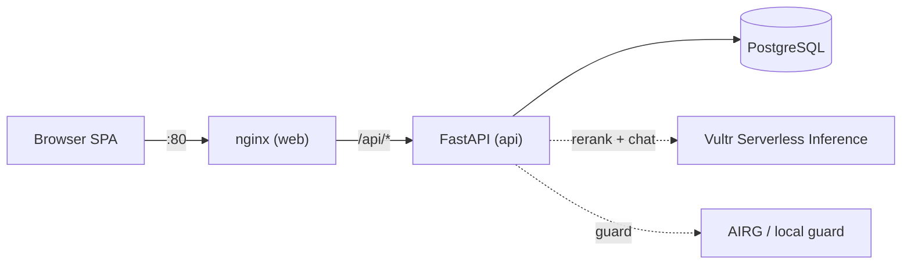
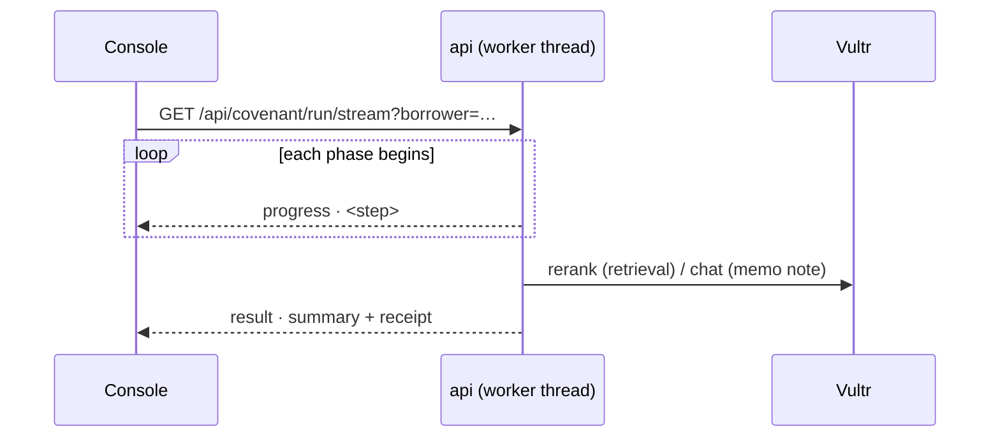

# CovenantOps Agent — Technical Reference

Engineering documentation for the team building and operating CovenantOps Agent.
End users never see this material; the product UI is deliberately user-centric and
free of backend/vendor jargon. This document is where the internals live.

- Product overview & user-facing capabilities: [`README.md`](README.md)
- Deployment runbook: [`docs/DEPLOY_VULTR.md`](docs/DEPLOY_VULTR.md)
- Operating notes for future agents: [`AGENTS.md`](AGENTS.md)

---

## 1. Stack & topology

| Layer | Tech | Notes |
| --- | --- | --- |
| Frontend | Vanilla-JS SPA (Vite build) | `frontend/src/main.js` renders everything; no framework. Talks to the API over `fetch` + SSE. |
| Edge | nginx | Serves the built SPA and reverse-proxies `/api` (and `/docs`) to the backend. Single public origin (`:80`). `index.html` is `no-store`; `/assets/*` are immutable. SSE uses `proxy_buffering off`. |
| Backend | FastAPI + Uvicorn (1 worker) | `backend/app`. One worker on purpose — signed receipts are held in-process between a run and its verification (`_traces`). |
| Persistence | PostgreSQL (prod) / SQLite (dev) | SQLAlchemy via `app/trust/trace_memory.py`. Falls back to in-memory if the DB is unreachable. |
| AI | Vultr Serverless Inference | Rerank (retrieval) + chat (reasoning/Q&A). See §5. |
| Governance | AIRG (optional) + local guard | See §6. |



## 2. Module map (`backend/app`)

| Path | Responsibility |
| --- | --- |
| `api.py` | All FastAPI routes. Process-lifetime singletons: `_governance`, `_receipts`, `_improver`, `_checkpoints`, `_inference`, `_memory`, `_traces`. |
| `agent/runner.py` | `CovenantAgent.run()` — the multi-step workflow. Emits start-of-phase `progress` events, threads `borrower_id`, records `retrieval_path`/`inference_path`. |
| `agent/memo.py` | `build_memo()` — severity, `raw_confidence = min(cross-check confidences)`, staleness-discounted `confidence`, memo text + citations. |
| `agent/learning.py` | Poisoning-gated cross-run lesson curation + `apply_lessons_to_crosscheck`. |
| `agent/evaluation.py` | `build_evidence_map`, `build_evaluation` (self-eval scores + signals). |
| `tools/finance_tools.py` | Borrower-aware tools: `retrieve_covenant_clauses`, `get_filings`, `calculate_ratio`, `cross_check_transactions`, `get_clauses`, `portfolio_status`, `list_borrowers`. Default borrower = PDF-grounded lead. |
| `tools/borrowers.py` | The portfolio registry (Alderbrook, Kestrel, Solent, Northwind) — per-borrower clauses, filings, transactions, waivers. |
| `tools/ingestion.py`, `tools/extractors/` | Multi-format ingestion (PDF/DOCX/XLSX/CSV/image-OCR), source-type classification, trust tagging, injection scan, supersession. |
| `trust/vultr_inference.py` | Vultr client: `reason()` (chat) + `rerank()` (VultronRetriever). Fail-safe, records `last_used`/`retrieval_used`. |
| `trust/governance.py` | `Governance.guard` (AIRG → local fallback) + `local_guard` (injection/PII rules). `_DOC_TOOLS` includes `covenant_qa`. |
| `trust/receipt.py` | Ed25519 signing + canonicalization; standalone verify in `backend/tools/verify_receipt.py`. |
| `trust/context_health.py` | Freshness / injection / source-authority / domain checks → staleness penalty. Scoped to the lead borrower (its evidence pack). |
| `trust/recovery.py` | Checkpoint + resume (`fail_after`, `RunInterrupted`). |
| `trust/trace_memory.py` | Durable runs + events; `list_runs`/`get_run_record` include `created_at`. |

## 3. Run lifecycle & workflow

`CovenantAgent.run()` phases (each wrapped by the governance guard via `_call`), with
a `progress(step)` callback fired at the **start** of each phase for live streaming:

1. `plan`
2. `retrieve_clauses` — Vultr rerank (VultronRetriever) over the borrower's clauses; local keyword fallback. Sets `retrieval_path`.
3. `pull_filings`
4. `calculate` — deterministic ratio per covenant (applies waivers)
5. `apply_waiver` — announced when the first effective threshold is resolved
6. `cross_check` — transactions → cause; unexplained items retained
7. context-integrity checks (lead borrower) → staleness penalty
8. `memo` — `build_memo` + Vultr analyst note (chat)
9. sign Ed25519 receipt

Two run entry points:
- `POST /api/covenant/run` — synchronous, returns the trace summary.
- `GET /api/covenant/run/stream` — runs the agent in a worker thread and streams
  `{"type":"progress","step":…}` frames as each phase begins, then
  `{"type":"result","run":…}`. This is what the console uses for the live workflow.



## 4. Multi-borrower portfolio

- The lead borrower (`meridian`) is grounded in the ingested credit-agreement PDF.
- Additional borrowers live in `tools/borrowers.py` with representative agreement
  terms, filings, and transactions. The **same** workflow runs per borrower.
- `finance_tools` dispatches on `borrower_id` (default → PDF path; otherwise registry).
- `GET /api/portfolio` returns each borrower with a fast, no-network
  `portfolio_status` (severity + raw cause-attribution confidence). The full run adds
  the analyst note, governance path, receipt, and staleness-adjusted confidence.
- Context health is scoped to the lead borrower so its evidence-pack freshness
  warnings don't contaminate other borrowers' confidence.

## 5. Vultr Serverless Inference

`trust/vultr_inference.py`, base `https://api.vultrinference.com/v1`, bearer auth.

| Use | Endpoint | Env / default |
| --- | --- | --- |
| Retrieval (rerank clauses) | `POST /v1/rerank` | `VULTR_RERANK_MODEL` = `vultr/VultronRetrieverPrime-Qwen3.5-8B` |
| Reasoning (analyst note, Q&A) | `POST /v1/chat/completions` | `VULTR_CHAT_MODEL` = `deepseek-ai/DeepSeek-V4-Flash` |

Notes:
- VultronRetriever models are **rerankers** (`features: ["ReRank"]`), not embeddings —
  the client sends `{query, documents}` and reads `results[].relevance_score`.
- Use a **non-reasoning** chat model; reasoning models (Kimi/Qwen/MiniMax) emit a
  `reasoning` field and return empty `content` under a small `max_tokens`, which
  silently degrades the analyst note/Q&A to local fallback.
- The **Serverless Inference key** (`api.vultrinference.com`) is different from the
  Vultr **account API key** (`api.vultr.com`, IP-allowlisted, used only to provision).
- Every run records `retrieval_path` and `inference_path` (`vultr` | `local`); surfaced
  via `GET /api/integrations/vultr/status`. These are engineering signals — the user UI
  presents them in plain language ("AI semantic search", "AI analyst note").

## 6. Governance boundary

- `Governance.guard(tool, args, output)` tries AIRG (`/actions/evaluate` +
  `/actions/scan-output` for `_DOC_TOOLS`) then fails safe to `local_guard`.
- `local_guard` applies graduated injection rules + PII detection; `block` withholds
  the content from the agent's reasoning. The guard path (`airg`/`local_fallback`) is
  recorded per tool call.
- `covenant_qa` is a `_DOC_TOOLS` member: **both** the user's question and the model's
  answer pass the guard. A blocked question is never sent to the model.

## 7. Verifiable receipts

- `receipt.py` builds a canonical (sorted-key, whitespace-free) JSON body, hashes it
  (SHA-256), and signs with Ed25519. The receipt embeds the public key.
- Offline verification (`backend/tools/verify_receipt.py`) recomputes the hash and
  checks the signature — no server needed.
- **Frontend gotcha:** never round-trip the receipt through the browser's
  `JSON.stringify` before verifying — it reserializes whole-number floats
  (`8000000.0 → 8000000`) and breaks the hash. The honest "Verify" path calls the
  server-side `GET /api/traces/{id}/receipt/verify`; the tamper demo intentionally
  mutates then POSTs to `/api/receipts/verify`.
- Set a stable `COVENANTOPS_SIGNING_KEY_B64` in production so receipts verify across
  restarts/replicas.

## 8. Persistence & history

- `AgentRunRow` (run_id, borrower, severity, confidence, created_at, payload) and
  `TraceEventRow`. `list_runs`/`get_run_record` return `created_at`.
- `GET /api/runs/{run_id}` reconstructs a run's outcome (from `_traces` if live, else
  the durable payload) so History entries are openable.
- Receipt verification and live Q&A require the trace in `_traces`; archived runs
  return `archived: true` and expose the memo/findings only.

## 9. Frontend notes (`frontend/src/main.js`)

- Single render loop (`render()` rewrites `#app` innerHTML). Inline `onclick`/`onchange`
  handlers are exposed on `window` (ES-module scope).
- Views: Portfolio (home) → Investigation (opened per borrower; breadcrumb + borrower
  switcher + Run again) → History (dated, clickable → outcome) → Audit (plain-language
  trail + evidence graph + integrity; engineering scores intentionally omitted).
- The live workflow streams **inside** the run panel from the SSE `progress` events —
  no timers.
- **User-centric rule:** vendor/model names (Vultr, VultronRetriever, AIRG) and raw
  signals (`guard_path`, trace IDs) stay out of the UI. Keep them here and in the API.

## 10. Configuration & deployment

- Env vars: see `README.md` §Configuration and `.env.example`. All external services
  are optional and fail safe.
- `docker compose up --build`: `web` (nginx, only public port), `api` (internal),
  `db` (internal, named volume). Healthchecks on api + db; `restart: unless-stopped`.
- Vultr Cloud Compute runbook: `docs/DEPLOY_VULTR.md`.

## 11. Testing

```bash
cd backend && python3 -m pytest tests -q     # 26 tests
```

Covers ingestion/threshold extraction, workflow + memo, receipt sign/verify + tamper,
governance fail-safe, poisoning-gated learning + ablation, recovery/resume,
multi-format trust tagging, waivers, evaluation/evidence-map, context health, and
persistent TraceMemory.

## 12. Extension points

- **New borrower:** add an entry to `tools/borrowers.py` (clauses, filings,
  transactions, waivers). The workflow and portfolio pick it up automatically.
- **New covenant type:** extend `COVENANTS_TO_TEST`, `calculate_ratio`, and the
  `cross_check_transactions` cause map.
- **Different models:** set `VULTR_CHAT_MODEL` / `VULTR_RERANK_MODEL` (list with
  `GET /v1/models`).
- **Real per-borrower evidence:** today uploads land in one shared pack and ground the
  lead borrower's context health; per-borrower evidence dirs are the next step.
